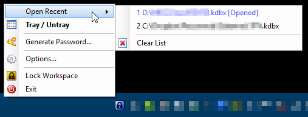

# KeePassTrayRecentFiles
A KeePass plugin to list your recent files directly on your systray icon

This plug-in will add the (exact) same "Open Recent" menu to your systray KeePass icon.

I believe this is a very useful plugin for people who use more than one KeePass databases on a daily basis (such as me).

## Instalation
As per [KeePass's documentation](http://keepass.info/help/v2/plugins.html), in order to **install** this plugin you should copy the [TrayRecentFiles.plgx](TrayRecentFiles.plgx) to your KeePass folder (usually %ProgramFiles% (x86)\KeePass Password Safe 2).

## Screenshots

## Notice
When this plugin was developed, [KeePass](http://keepass.info/) was in version **2.29**. I have followed the [KeePass' recomendations](http://keepass.info/help/v2_dev/plg_index.html#plgx) and provided this plugin as a **PLGX** in order to be able to early detect any future breaking changes.

## Thank you
It was a great pleasure to develop this plugin, I had already used KeePass' API, and it was a charm to develop. Having access to KeePass' source code and having already some experience with WinForms made this development relatively easy.

## Disclaimer
This plugin is provided AS-IS. I tested it on my own machine, with some of the relevant KeePass' settings and it worked just fine, for my needs. The plugin's source code is available and any recommendation or change is more than welcome.
